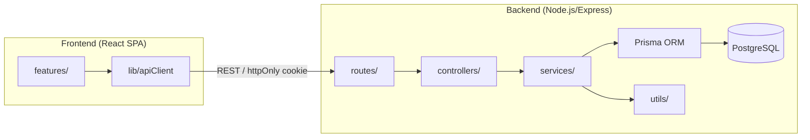
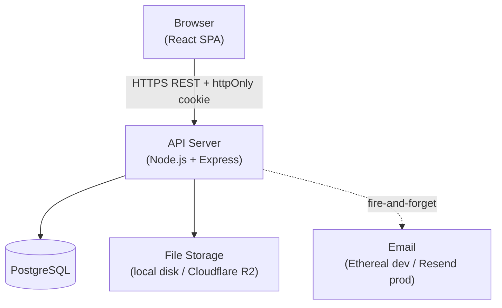
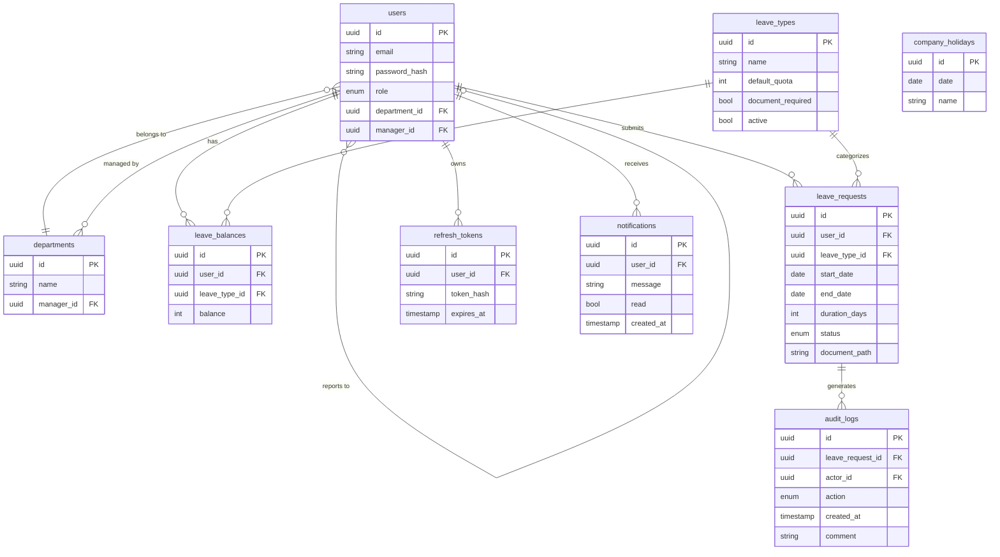
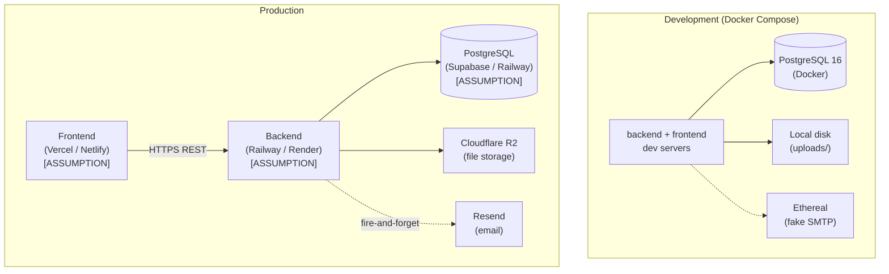

# Architecture Spine — Employee Leave Management System

## Design Paradigm

**Layered REST API + Feature-Slice SPA**

The backend is a strict top-down layered system; the frontend is organized into vertical feature slices sharing a thin common library.



Backend dependency rule: routes → controllers → services → Prisma. Services may call sibling services (e.g. `leaveRequest` calls `audit`, `notification`) but **never** routes or controllers. Dependency arrows never reverse.

Frontend dependency rule: `features/` import from `lib/` and `components/`; `lib/` imports nothing from `features/`. All cross-boundary communication is via REST.

---

## Invariants & Rules

### AD-1 — RBAC enforced server-side on every protected route

- **Binds:** All API routes; NFR-SEC-1
- **Prevents:** UI-only RBAC bypass — a user hitting the API directly bypasses all frontend guards
- **Rule:** Every protected route passes through `middleware/auth` (validates JWT) then `middleware/rbac` (asserts required role). Frontend role-checks are UI convenience only and do not substitute for server enforcement.

### AD-2 — `leave_balances` table is the authoritative balance store

- **Binds:** FR-BAL, FR-REQ, FR-APPR
- **Prevents:** Two builders deriving balances differently — one from the `leave_balances` table, another by summing approved `leave_requests`
- **Rule:** All balance reads and writes go through `services/leaveBalance`. No code may calculate a balance by aggregating `leave_requests`; the `leave_balances` row is always the answer.

### AD-3 — All list endpoints are server-side paginated

- **Binds:** FR-SRCH, FR-REQ, FR-APPR, FR-RPT, FR-AUDIT, FR-EMP
- **Prevents:** Unbounded queries and inconsistent pagination contracts across the frontend
- **Rule:** Every list endpoint accepts `?page=&limit=` (default `limit=20`) and returns `{ success, data: T[], meta: { page, limit, total } }`. No endpoint returns an unbounded array.

### AD-4 — Balance mutation and leave status change are a single Prisma transaction; overlap check and cancel restore are transaction-scoped

- **Binds:** FR-BAL-4, FR-APPR-4, FR-APPR-5, FR-REQ-2, FR-REQ-4
- **Prevents:** Approved leave with no balance deduction; orphaned deduction on status-update failure; TOCTOU race on concurrent submissions passing the overlap check independently; cancel restoring a different value than was originally deducted
- **Rule:** (1) `approve()`, `reject()`, and `cancel()` execute all DB writes inside `prisma.$transaction`. (2) The overlap-availability SELECT in `submit()` runs inside the same transaction as the insert — not as a controller pre-check. (3) `cancel()` restores exactly the `duration_days` stored on the `leave_requests` row; re-computation at cancel time is prohibited.

### AD-5 — Access token lives in client memory; refresh token lives in httpOnly cookie

- **Binds:** FR-AUTH-4, NFR-SEC-3
- **Prevents:** XSS extraction of tokens from localStorage or sessionStorage
- **Rule:** The API sets the refresh token as a `HttpOnly; SameSite=Strict` cookie. The frontend stores the decoded access token (and user profile) in `AuthContext` React state only — never in `localStorage`, `sessionStorage`, or a JS-readable cookie.

### AD-6 — File I/O goes through a storage abstraction

- **Binds:** FR-REQ-5, FR-APPR-6, NFR-SEC-2
- **Prevents:** Dev (local disk) and prod (Cloudflare R2) diverging in upload and URL-generation logic
- **Rule:** `utils/storage.ts` is the only place that touches the filesystem or R2 SDK. It exposes `save(buffer, filename): Promise<string>` and `getSignedUrl(filename): Promise<string>`. The active backend is selected by `STORAGE_PROVIDER` env var (`local` | `r2`).

### AD-7 — Email notifications are fire-and-forget

- **Binds:** FR-NOTIF-1, FR-NOTIF-2, FR-NOTIF-3
- **Prevents:** An email send failure rolling back a leave approval or causing a 500 response
- **Rule:** Services call `utils/email.send()` **after** the database transaction commits. `email.send()` catches its own errors, logs them, and never re-throws. The HTTP response is sent independently of email delivery.

### AD-8 — Audit log is append-only; no update or delete ever touches `audit_logs`

- **Binds:** FR-AUDIT-3
- **Prevents:** Audit trail tampering or accidental deletion of leave action history
- **Rule:** `services/audit` exposes only `append(entry)`. No `update` or `delete` method exists in the audit service. Application code may never issue `UPDATE` or `DELETE` against the `audit_logs` table.

### AD-9 — Working-day calculation is server-side; the client displays the result

- **Binds:** FR-REQ-2, FR-HOL-2
- **Prevents:** Client and server computing different durations for the same date range and holiday set
- **Rule:** `utils/workingDays.ts` is the single implementation. It is called by `services/leaveRequest` at submission and approval time. The frontend renders the server-returned `duration_days` field; it does not recalculate.

### AD-10 — Unified API response envelope

- **Binds:** All API routes
- **Prevents:** Frontend `apiClient` needing per-endpoint logic to extract data or distinguish success from failure
- **Rule:** Every response body is `{ success: boolean, data?: T, error?: string, meta?: { page, limit, total } }`. HTTP status codes carry semantics (200/201/400/401/403/404/409/500). No custom numeric error codes.

### AD-11 — Frontend and backend are sibling directories; no shared runtime module [ASSUMPTION: monorepo]

- **Binds:** All; NFR-DEPL-1
- **Prevents:** Backend code imported into the frontend bundle; cross-boundary coupling that breaks separate deployment
- **Rule:** `frontend/` and `backend/` are top-level sibling directories. Nothing in `frontend/` may import a path from `backend/` at runtime. Shared TypeScript types live in `frontend/src/lib/types.ts` (manually kept in sync) or a `shared/` workspace package.

### AD-12 — Annual balance reset is a scheduled backend job, not an HTTP endpoint

- **Binds:** FR-BAL-3
- **Prevents:** Accidental reset via HTTP call; reset running multiple times across instances
- **Rule:** Implement as a `node-cron` job inside the backend process or a DB-level scheduled function. Do not expose a `POST /admin/reset-balances` route.

### AD-13 — PDF export uses `@cantoo/pdf-lib`; Puppeteer is excluded from v1 [ADOPTED]

- **Binds:** FR-RPT-4
- **Prevents:** A 300 MB headless browser dependency for simple tabular reports; dependency on an unmaintained library (`pdf-lib` upstream is abandoned)
- **Rule:** All PDF generation goes through `utils/pdf.ts` using `@cantoo/pdf-lib` (the actively maintained fork of `pdf-lib`). Migrate to Puppeteer only if layout complexity demands it (v2 decision).

### AD-14 — Notification recipient contract is fixed per event type

- **Binds:** FR-NOTIF-1, FR-NOTIF-2, FR-NOTIF-3
- **Prevents:** Builder A notifying only the employee on approval; Builder B also copying the manager — or vice versa
- **Rule:** SUBMITTED → employee's reporting manager; APPROVED → submitting employee; REJECTED → submitting employee; ADMIN_CANCELLED → submitting employee. No other recipients unless a future AD extends this.

### AD-15 — `leave_balances` rows are provisioned eagerly, never lazily

- **Binds:** FR-BAL, AD-2
- **Prevents:** Lazy on-read creation silently crediting `0` instead of `default_quota`; missing rows for users created before a leave type was added
- **Rule:** `services/user.create()` inserts one `leave_balances` row per active leave type (using `default_quota`). When a new leave type is added, a migration or admin action also creates rows for all existing employees. Lazy creation on first read is prohibited.

### AD-16 — Every notifiable event writes an in-app `notifications` row AND calls `email.send()`

- **Binds:** FR-NOTIF-1 through FR-NOTIF-4, AD-7
- **Prevents:** One builder using only email; another using only the `notifications` table
- **Rule:** `services/notification.trigger(event, userId)` always writes a `notifications` row and always calls `utils/email.send()`. Neither path is optional. Email failures (AD-7) do not prevent the `notifications` row from being written.

---

## Consistency Conventions

| Concern | Convention |
|---|---|
| File naming | `camelCase.ts` for source files; Prisma models in `PascalCase` |
| HTTP routes | `kebab-case` plural nouns: `/leave-requests`, `/leave-types`, `/company-holidays` |
| Entity IDs | UUID (`@default(uuid())` in Prisma schema); sequential integers never exposed in API responses |
| Dates | `YYYY-MM-DD` string for calendar dates; ISO 8601 UTC timestamp for `createdAt`/`updatedAt`; never JS `Date` objects in API payloads |
| API envelope | `{ success, data?, error?, meta? }` per AD-10; `error` is always a human-readable string |
| Auth header | `Authorization: Bearer <access_token>` on all protected requests; refresh via `POST /auth/refresh` reading the httpOnly cookie |
| State mutation | All writes go through `services/`; controllers are thin (parse → call service → respond); no Prisma calls in controllers or routes |
| Environment secrets | DB URL, JWT secret, R2 credentials, email API key — environment variables only; loaded via `prisma.config.ts` for Prisma (no auto-load in v7); no hardcoded values (NFR-SEC-4) |
| Migrations | All schema changes via `prisma migrate dev` / `deploy`; never alter the DB directly |
| Role names | Enum values: `ADMIN`, `MANAGER`, `EMPLOYEE` (uppercase, in DB and JWT `role` claim) |
| TailwindCSS config | CSS-first (v4): configure via `@theme` directive in the root CSS file; no `tailwind.config.js` |

---

## Stack

*Versions web-verified 2026-06-29. See memlog for breaking-change notes on major version bumps.*

| Name | Version | Notes |
|---|---|---|
| Node.js | 24 LTS | Node 20 EOL Apr 2026 |
| TypeScript | 6.x | 6.0 current stable; TS 7 (Go rewrite) in RC — not yet stable |
| Express | 5.x | 4.x in Maintenance; start new projects on 5 |
| Prisma | 7.x | **Breaking rewrite**: datasource config moves to `prisma.config.ts`; driver adapters required (`@prisma/adapter-pg`); ESM-only; env vars not auto-loaded |
| PostgreSQL | 16 | Supported (16.x); 18 is latest — acceptable to start on 16 |
| React | 18.x | Current production-recommended LTS |
| TailwindCSS | 4.x | **CSS-first config** — no `tailwind.config.js`; configure via `@theme` in CSS |
| TanStack Query | 5.x | Current |
| React Router | 7.x | v6 EOL; v8 requires React 19 — not our stack |
| Multer | 2.x | |
| jsonwebtoken | 9.x | Current |
| bcryptjs | 3.x | |
| Nodemailer | 9.x | `disableFileAccess`/`disableUrlAccess` now default `true`; NTLM removed |
| csv-stringify | 6.x | Current |
| @cantoo/pdf-lib | 2.x | Active fork of abandoned `pdf-lib` (AD-13) |
| node-cron | 4.x | API change: `running` → `isActive` (read-only); no EventEmitter |
| @aws-sdk/client-s3 (R2 compat) | 3.x | Current |
| @prisma/adapter-pg | 7.x | Required by Prisma 7 for PostgreSQL |

---

## Structural Seed

```text
employee-leave-management-system/
  backend/
    src/
      routes/             # Express router registrations (one file per resource)
      controllers/        # Thin request/response handlers; no business logic
      services/           # Business logic and all Prisma access
        leaveRequest.ts   #   submit, approve, reject, cancel
        leaveBalance.ts   #   read, deduct, restore, reset
        audit.ts          #   append-only entries (AD-8)
        notification.ts   #   trigger fire-and-forget emails (AD-7)
      middleware/
        auth.ts           # JWT validation; attaches req.user
        rbac.ts           # Role assertion; uses req.user.role (AD-1)
        upload.ts         # Multer config; file type + size enforcement (NFR-SEC-2)
        error.ts          # Centralized error handler; formats envelope per AD-10
      prisma/
        schema.prisma
        prisma.config.ts  # Prisma 7: datasource URL + adapter config (replaces .env auto-load)
        migrations/
        seed.ts           # Idempotent demo seed (FR-SEED)
      utils/
        workingDays.ts    # AD-9: duration calc
        storage.ts        # AD-6: local / R2 abstraction
        email.ts          # AD-7: fire-and-forget send
        pdf.ts            # AD-13: pdf-lib report generation
        csv.ts            # csv-stringify report generation
      jobs/
        resetBalances.ts  # AD-12: node-cron January 1 reset
      app.ts              # Express app + middleware wiring
      server.ts           # HTTP listener; mounts app + starts jobs
  frontend/
    src/
      features/
        auth/             # Login page, token refresh logic
        leaves/           # Submit, history, approve/reject, cancel
        employees/        # Admin CRUD
        departments/      # Admin CRUD
        leaveTypes/       # Admin CRUD
        holidays/         # Admin CRUD, shared read-only display
        calendar/         # Manager month-view team calendar
        reports/          # Generate + export CSV/PDF
        audit/            # Admin audit log view
        profile/          # Employee self-service profile edit
      components/         # Shared UI (Table, Modal, Badge, Pagination, etc.)
      context/
        AuthContext.tsx   # AD-5: access token + user state in React memory only
      lib/
        apiClient.ts      # Axios/fetch wrapper; attaches Bearer token; handles 401→refresh
        queryClient.ts    # TanStack Query global client config
        types.ts          # Shared TypeScript interfaces (sync'd with Prisma output types)
        constants.ts
      pages/              # Route-level components; import from features/
      App.tsx             # React Router setup; RequireRole wrappers enforcing AD-1
  docker-compose.yml      # Dev: Postgres 16 + pgAdmin
  .env.example
  README.md               # Seed credentials per FR-SEED-1
```

### System Container View



### Core Entity Model



### Deployment Topology



---

## Capability → Architecture Map

| Capability | Lives in | Governed by |
|---|---|---|
| FR-AUTH | `services/auth`, `middleware/auth`, `middleware/rbac`, `context/AuthContext`, `features/auth` | AD-1, AD-5 |
| FR-EMP | `services/user`, `controllers/employees`, `features/employees` | AD-1, AD-3 |
| FR-DEPT | `services/department`, `features/departments` | AD-1 |
| FR-LT | `services/leaveType`, `features/leaveTypes` | AD-1 |
| FR-BAL | `services/leaveBalance`, `prisma/leave_balances` | AD-2, AD-4, AD-15 |
| FR-HOL | `services/holiday`, `utils/workingDays` | AD-9 |
| FR-REQ | `services/leaveRequest.submit`, `utils/workingDays`, `features/leaves` | AD-2, AD-4, AD-9 |
| FR-APPR | `services/leaveRequest.approve/reject`, `features/leaves` | AD-1, AD-4, AD-8 |
| FR-NOTIF | `utils/email`, `services/notification`, `prisma/notifications` | AD-7, AD-14, AD-16 |
| FR-CAL | `features/calendar` (read-only) | AD-1 |
| FR-DASH | Role dashboard pages; aggregate reads from multiple services | AD-1, AD-3 |
| FR-SRCH | All list controllers + service filter params | AD-3 |
| FR-RPT | `utils/csv`, `utils/pdf`, `features/reports` | AD-1, AD-3, AD-13 |
| FR-AUDIT | `services/audit`, `features/audit` | AD-1, AD-3, AD-8 |
| FR-PROFILE | `services/user.updateProfile`, `features/profile` | AD-1 |
| FR-SEED | `prisma/seed.ts` | NFR-DEPL-2 |

---

## Deferred

- **Production hosting provider** — Vercel vs Netlify (frontend), Railway vs Render (backend), Supabase vs Railway (DB). Pick at deployment time; the spine is agnostic to the specific provider.
- **React form library** — React Hook Form vs plain controlled components. Per-feature decision; no cross-feature consistency requirement.
- **In-app notification delivery** — polling interval or WebSocket upgrade for FR-NOTIF-4. Not load-bearing for the v1 leave lifecycle; decide when building the notification badge.
- **Shared type package** — whether to extract `shared/` as a formal npm workspace. Manually sync'd `lib/types.ts` is sufficient to start; upgrade if type drift becomes a problem.
- **Rate limiting on auth endpoints** — brute-force protection on `POST /auth/login`. Worth adding before public exposure; not a v1 blocker for a portfolio deployment.
- **Carry-forward** — explicitly out of scope v1 (PRD § 7).
